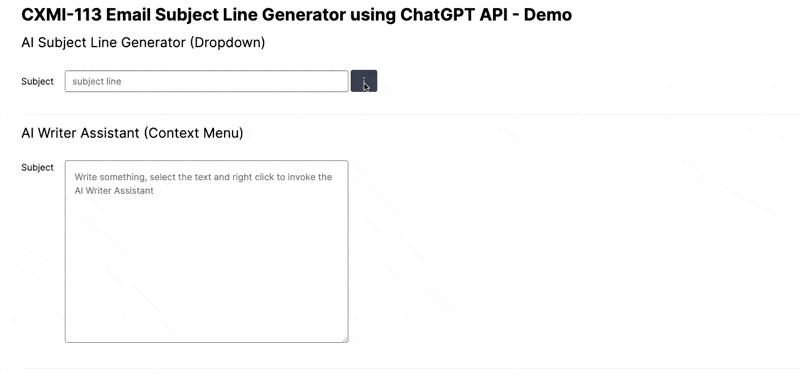
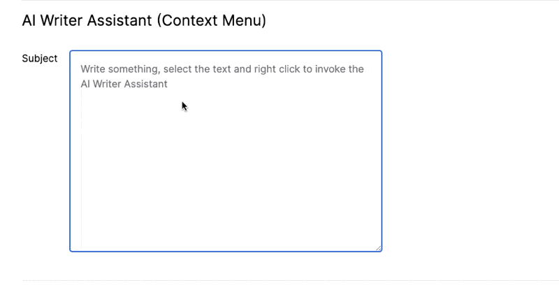
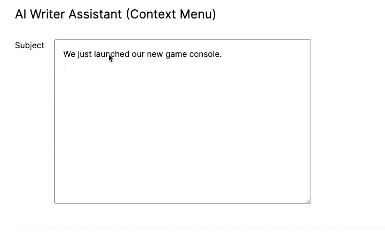
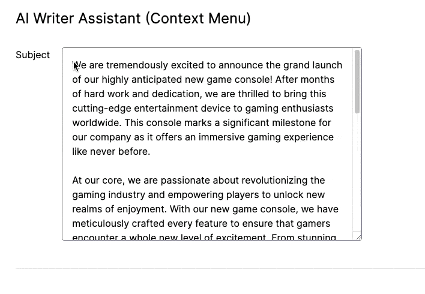
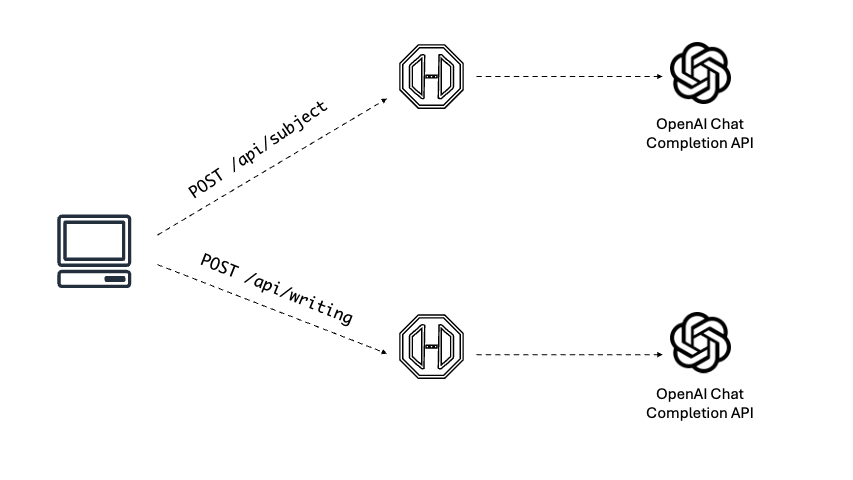
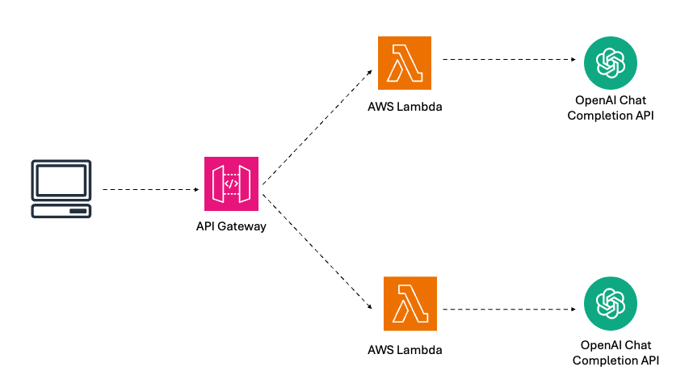

## AI Subject Line Generator

This Proof of Concept project utilizes the OpenAI chat completion API to generate subject lines based on the user provided description and tone of voice.

### Subject Line Generator

### Writing Assistant
I have also added an AI Writer Assistant feature that can check spelling and grammar, adjust sentence length, and modify the tone of voice.

#### Check Spelling and Grammar

#### Make Longer

#### Change Tone of Voice

## Tech Stack
- NextJS
- OpenAI
- Radix UI

## Workflow
The implementation of this Proof of Concept is straightforward. It involves creating two endpoints in the NextJS route. One endpoint is a `POST` request to `api/subject` for generating an email subject line, and the other is a `POST` request to `api/writing` for the AI Writing assistant. Both endpoints will make an API call to the OpenAI chat completion API.

The actual implementation of this feature is yet to be decided. However, I imagine that the request will pass through the API Gateway, which will invoke a lambda function. This function will then make an API call to the OpenAI API.

